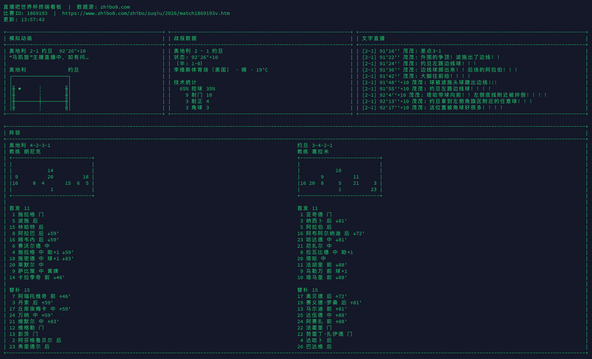

# 直播吧世界杯 2026 · 终端看板

在终端里实时观看 **2026 世界杯** 比赛：文字直播、怪兽简报、阵型阵容、技术统计与简易球场动画，数据来自 [直播吧](https://www.zhibo8.com/) / 球迷宝公开接口。

## 演示



*奥地利 vs 约旦 · 含模拟动画、战报数据、文字直播与双方阵型*

录屏：[data/live_demo_video.mov](data/live_demo_video.mov)

## 功能概览

| 区域 | 内容 |
|------|------|
| 球场动画 | ASCII 球场、球位随动画帧与文字直播关键词更新 |
| 战报 | 比分、半场、场地/天气、技术统计、事件时间线 |
| 文字直播 | 解说员实时文字，按比分与时间戳展示 |
| 阵容 | 双方阵型图示、首发与替补名单 |

终端使用备用屏幕全屏刷新，适配不同窗口大小；窗口较小时自动紧凑布局。

## 环境要求

- Python 3.10+
- 可访问直播吧 / 球迷宝相关域名的网络环境
- 支持 ANSI 转义序列的终端（macOS Terminal、iTerm2、Windows Terminal、多数 Linux 终端）

## 安装

```bash
git clone <仓库地址>
cd terminal_worldcup_2026_by_zhibo8

python3 -m venv venv
source venv/bin/activate   # Windows: venv\Scripts\activate
pip install -r requirements.txt
```

## 使用

### 交互选择当日比赛

```bash
python main.py
```

程序会列出当天世界杯赛程，输入序号进入对应比赛的文字直播看板。首次加载会并行拉取数据，通常比旧版更快。

### 命令行参数

```bash
python main.py --match 1869193              # 直接指定 saishi_id
python main.py --match match1869193v        # 或 URL 中的 match 片段
python main.py --date 2026-06-17            # 指定日期（默认今天）
python main.py --match 1869193 --once       # 只刷新一次后退出（调试用）
```

按 `Ctrl+C` 或 `Q` 退出看板。看板内按 `T` 切换阵容/球员名单，`R` 强制刷新全部数据。

## 配置

运行时会将当前比赛写入项目根目录 `config.json` 的 `zhibo8` 字段，下次可配合 `--match` 快速进入。

```json
{
  "zhibo8": {
    "saishi_id": "1869193",
    "match_date": "2026-06-17",
    "poll_intervals": {
      "livetext": 2,
      "animate": 2,
      "lineup": 60,
      "score": 10,
      "report": 30
    }
  }
}
```

| 字段 | 说明 | 默认（秒） |
|------|------|------------|
| `livetext` | 文字直播轮询间隔 | 2 |
| `animate` | 球场动画数据轮询间隔 | 2 |
| `lineup` | 阵容轮询间隔 | 60 |
| `score` | 比分与比赛状态轮询间隔 | 10 |
| `report` | 技术统计与事件轮询间隔 | 30 |

## 项目结构

```
terminal_worldcup_2026_by_zhibo8/
├── main.py              # 入口：选赛、轮询、全屏刷新
├── config.json          # 用户配置（比赛 ID、轮询间隔等）
├── requirements.txt
├── data/
│   ├── live_demo_photo.png   # 运行效果截图
│   └── live_demo_video.mov   # 运行效果录屏
└── src/
    ├── client.py        # HTTP 客户端（requests Session）
    ├── api.py           # 直播吧 / 球迷宝 API 封装
    ├── config.py        # 配置读写
    ├── animator.py      # 球场动画与球位逻辑
    └── dashboard.py     # 终端面板布局与渲染
```

## 工作原理

1. **选赛**：从 `bifen4m.qiumibao.com` 拉取赛程列表，筛选联赛 ID 为世界杯（`4`）且日期匹配的比赛。
2. **轮询**：按配置间隔分别请求比分、阵容、动画帧、文字直播增量、球队统计与比赛事件。
3. **动画**：`animate_v2` 接口提供帧数据；文字直播中的「射门」「角球」「进球」等关键词会驱动球位；进行中比赛还有简易持球摆动动画。
4. **渲染**：`dashboard.py` 将各面板拼成固定布局，通过 ANSI 备用屏幕清屏刷新。

## 说明与免责

- 本项目仅供学习与个人观赛体验，数据版权归直播吧及相应数据提供方所有。
- 接口为公开 JSON，无官方 SDK；字段或域名变更可能导致部分功能失效。
- 请勿高频请求，建议保持默认轮询间隔。

## 许可证

见仓库 LICENSE（如有）。
